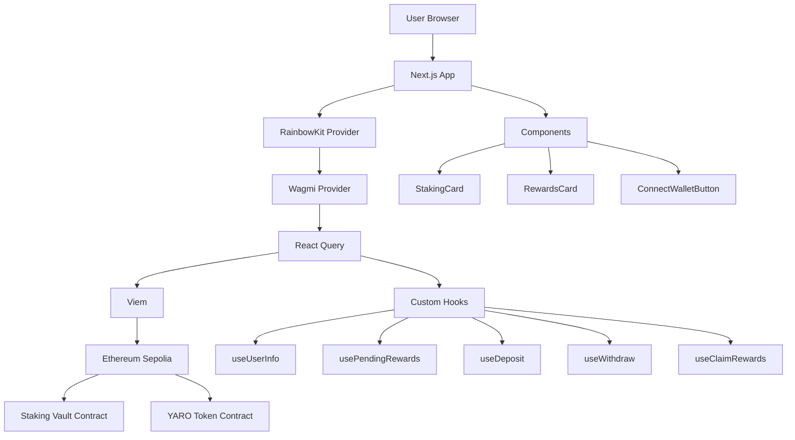
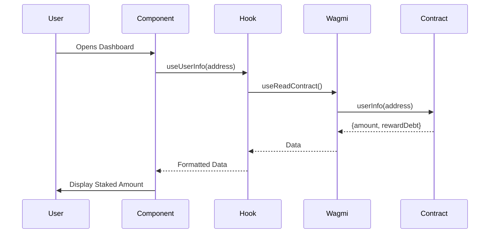
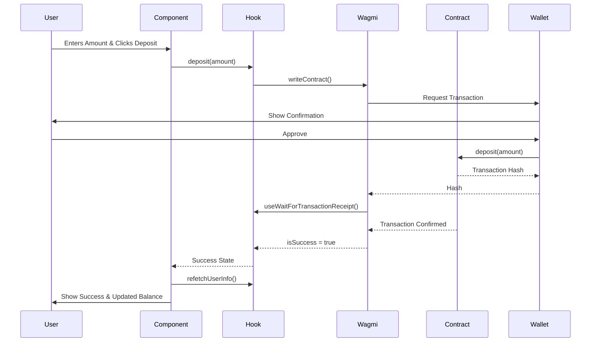

# Architecture Documentation

## Overview

This document describes the architecture of the Yaroslav Staking Vault Web3 DApp, including the flow of data, component structure, and contract interactions.

## System Architecture



## Component Architecture

### Page Structure

```
app/
├── layout.tsx          # Root layout with providers
├── page.tsx            # Landing page
└── dashboard/
    └── page.tsx        # Main staking interface
```

### Component Hierarchy

```
DashboardPage
├── ConnectWalletButton
├── StakingCard
│   └── InputBox (deposit)
│   └── InputBox (withdraw)
└── RewardsCard
    └── Claim Button
```

## Data Flow

### Reading On-Chain Data



### Writing On-Chain Data (Deposit)



## Contract Interaction Sequence

### Deposit Flow

1. **Check Allowance**
   - Read `allowance(userAddress, vaultAddress)` from YARO token
   - If insufficient, show "Approve" button

2. **Approve (if needed)**
   - Call `approve(vaultAddress, amount)` on YARO token
   - Wait for transaction confirmation

3. **Deposit**
   - Call `deposit(amount)` on staking vault
   - Wait for transaction confirmation
   - Refetch user info and balance

### Withdraw Flow

1. **Validate Amount**
   - Check user has sufficient staked amount
   - Validate input is positive

2. **Withdraw**
   - Call `withdraw(amount)` on staking vault
   - Contract automatically claims pending rewards
   - Wait for transaction confirmation
   - Refetch user info and balance

### Claim Rewards Flow

1. **Check Pending Rewards**
   - Read `pendingRewards(userAddress)` from vault
   - Display amount to user

2. **Claim**
   - Call `claimRewards()` on staking vault
   - Wait for transaction confirmation
   - Refetch pending rewards (should be 0)

## State Management

### React Query Integration

The app uses React Query (TanStack Query) for:
- **Caching**: Contract read results are cached
- **Refetching**: Automatic refetch intervals
- **Optimistic Updates**: Immediate UI updates
- **Error Handling**: Built-in error states

### Refetch Intervals

- **Pending Rewards**: 5 seconds (real-time updates)
- **User Info**: 10 seconds
- **Total Staked**: 10 seconds
- **Token Balance**: 10 seconds

## Custom Hooks

### useUserInfo
- Reads user's staked amount and reward debt
- Returns formatted data
- Auto-refetches every 10 seconds

### usePendingRewards
- Calculates pending rewards for user
- Updates every 5 seconds for real-time display
- Returns formatted reward amount

### useDeposit
- Handles deposit transaction
- Manages loading and success states
- Triggers data refetch on success

### useWithdraw
- Handles withdraw transaction
- Manages loading and success states
- Triggers data refetch on success

### useClaimRewards
- Handles reward claiming
- Manages loading and success states
- Refetches pending rewards on success

## Error Handling

### Transaction Errors
- Network errors: Displayed to user
- Revert errors: Parsed and shown
- User rejection: Silently handled

### Data Fetching Errors
- Retry logic via React Query
- Fallback to cached data
- Error boundaries for component errors

## Performance Optimizations

1. **Code Splitting**: Next.js automatic code splitting
2. **Lazy Loading**: Components loaded on demand
3. **Caching**: React Query caches contract reads
4. **Debouncing**: Input validation debounced
5. **Memoization**: Expensive calculations memoized

## Security Considerations

1. **Input Validation**: All user inputs validated
2. **Transaction Confirmation**: Users must confirm all transactions
3. **Network Validation**: Ensures correct network (Sepolia)
4. **Address Validation**: Contract addresses verified
5. **Error Messages**: Clear, non-technical error messages

## Future Enhancements

- [ ] Transaction history
- [ ] Reward history chart
- [ ] Multi-chain support
- [ ] Mobile app (React Native)
- [ ] Advanced analytics
- [ ] Social features

## Contract Methods Used

### Read Functions
- `userInfo(address)` - Get user staking info
- `pendingRewards(address)` - Get pending rewards
- `totalStaked()` - Get total staked amount
- `rewardRate()` - Get current reward rate
- `balanceOf(address)` - Get token balance (ERC20)
- `allowance(owner, spender)` - Get token allowance (ERC20)

### Write Functions
- `deposit(uint256)` - Stake tokens
- `withdraw(uint256)` - Unstake tokens
- `claimRewards()` - Claim pending rewards
- `approve(address, uint256)` - Approve token spending (ERC20)

## Network Configuration

- **Network**: Ethereum Sepolia Testnet
- **Chain ID**: 11155111
- **RPC**: Configurable via environment variable
- **Explorer**: https://sepolia.etherscan.io

